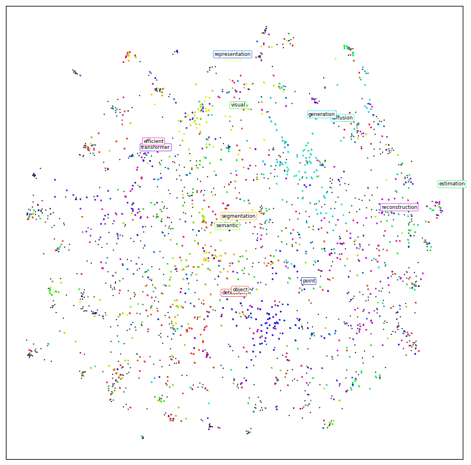

# papers_visualization
論文をt-sneやumapなどで可視化させる

## 環境構築
基本はrequirements.txtを使って環境作成してください`pip install -r requirements.txt`  
一応pyproject.toml作ったけど動くか確認してないです  
## Usage
- step.1 papers_collect.pyで論文情報をダウンロードする
- step.2 visualize_notebookかpapers_visualize.pyで可視化させる

## ダウンロードできる国際会議論文
- cvpr  
そのうち増やす
